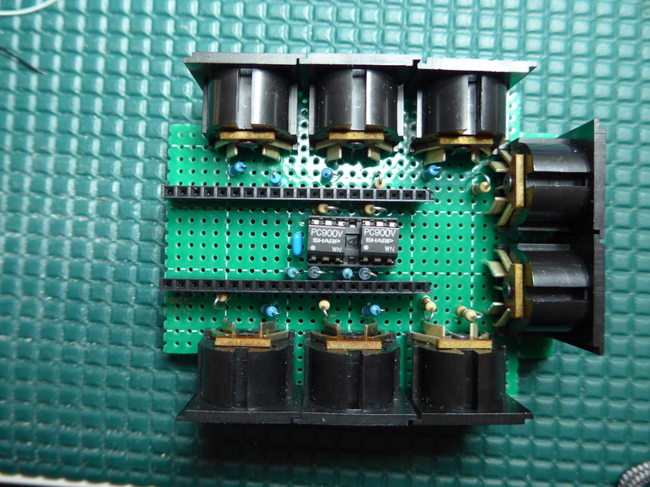

# midi-multistream2usbdev
2-in, 6-out 5 pin DIN MIDI to USB MIDI converter for the Raspberry Pi Pico


This project uses a single Raspberry Pi Pico board, some resistors and
capacitors, 2 H11L1/Sharp PC900V optoisolators, and 8 5-pin DIN connectors
to make a USB device that gives a PC two MIDI In ports and six MIDI Out ports.
It uses the PIO hardware inside the Pico board's RP2040 chip to create
the serial ports that the DIN MIDI connectors require. It uses the RP2040's
USB hardware for the USB interface. The device is bus powered; no external
power supply is required.

# Usage
Plug the Pico board microUSB connector to a suitable USB host (normally a
computer such as a PC or Mac). The computer enumerates the Pico board
USB as a MIDI device with 2 input ports and 6 output ports. The software
assigns each port sequentially to a MIDI IN or MIDI OUT connector. No
user configuration is required.

A Linux PC, a Mac, an iPhone or an iPad running MIDI software should show
the input ports as MIDI IN A and MIDI IN B and the outputs as MIDI OUT A,
MIDI OUT B, ..., MIDI OUT E, and MIDI OUT F. Windows PCs ignore the strings
on the MIDI jack descriptors.

Please post bug reports to this project if you discover any issues, if
you require more documentation, or if you require assistance.

# Build Instructions
This assumes you have installed the `pico-sdk` in `${PICO_SDK_PATH}`. I have only
tested this code using the Debug build type, so if you use other build types,
it may not work correctly (if you do not use the Debug build type and discover
an issue, please post a bug anyway. I am always trying to make code better).

```
cd ${PICO_SDK_PATH}/..
git clone https://github.com/rppicomidi/midi-multistream2usbdev.git
cd midi-multistream2usbdev
git submodule update --recursive --init
mkdir build
cd build
cmake -DCMAKE_BUILD_TYPE=Debug ..
make
```

# Harware details
The MIDI OUT pins all use the pio_midi_uart_lib to simulate open drain
UART outputs. No buffer chips are required. Wire the MIDI OUT pins
with a 33 ohm and a 10 ohm resistor as required by the [MIDI 3.3V 5-pin DIN
specification](https://www.midi.org/specifications/midi-transports-specifications/5-pin-din-electrical-specs).
Both MIDI IN pins all use pio_midi_uart_lib to create UART receivers. You
need to add an appropriate optoisolator such as a Sharp PC900V or a H11L1
between each 5-pin DIN connector and the Pico board MIDI IN pin per the above
spec and this [circuit](https://diyelectromusic.wordpress.com/2021/02/15/midi-in-for-3-3v-microcontrollers/).

The I/O pins are

| Pin Number |  Name      |  GPIO Number |
| ---------- | ---------- | ------------ |
| 7          | MIDI IN A  | 5            |
| 10         | MIDI IN B  | 7            |
| 6          | MIDI OUT A | 6            |
| 9          | MIDI OUT B | 8            |
| 14         | MIDI OUT C | 10           |
| 24         | MIDI OUT D | 18           |
| 5          | MIDI OUT E | 3            |
| 32         | MIDI OUT F | 27           |

I built the circuit to fit into a very small plastic box. To make it fit, I hid the
optoisolators under the Pico board. You can see the 0.1 uF bypass capacitor I used
for the 3.3V power supply on the PC900V chips. The two MIDI In connectors are on
the right edge of the board, and the MIDI Out connectors on the upper and lower
edges. The first photo at the beginning of this document shows the fully assembled
board. It uses the built-in microUSB connector of the Pico board to attach to the
computer. 



# How the code works
This project uses the `pico-sdk` and the `tinyusb` project for the USB access. The
`usb_descriptors.c` file implements all the functions `tinyusb` requires to allow
the USB host to enumerate the device. Because `tinyusb` only provides macros for
easily creating MIDI devices with a single MIDI IN virtual cable and a single
MIDI OUT virtual cable, the file `midi_device_multistream.h` provides additonal
macros (with the help of the Boost preprocessor library) to allow arbitrary variable
numbers of virtual cables per endpoint (from 1-16). Both MIDI inputs and the first 2
MIDI outputs use the `pio_midi_uart_lib` `midi_uart` state
machines in PIO0. The other 4 MIDI outputs use the `pio_midi_uart_lib` `midi_out`
state machines in PIO1. The `pio_midi_uart_lib` uses the `ring_buffer_lib` library
to manage the MIDI IN and MIDI OUT serial port FIFOs. When a MIDI IN input receives data,
the main loop pushed it out to the USB IN endpoint. The `tinyusb` library
already correctly supports sending MIDI IN data from the DIN connectors to the USB IN
endpoint on the correct virtual cable. Demultiplexing the MIDI OUT data from
the USB OUT endpoint requires code in the function `tud_midi_demux_stream_read()`.
The main loop calls that function periodically to set the stream buffer and
cable number variables if there is valid data. The function returns 0 and does
nothing if there is no MIDI data from the USB host to parse. The main loop
sends any MIDI stream data received to the appropriate MIDI out based on the cable
number `tud_midi_demux_stream_read()` parsed from the received packet.

The `midi_device_multistream.h` file uses the following new configuration
variables in `tusb_config.h`

```
// Number of virtual MIDI cables IN to the host
#define CFG_TUD_MIDI_NUMCABLES_IN 2
// Number of virtual MIDI cables OUT from the host
#define CFG_TUD_MIDI_NUMCABLES_OUT 6
// Support MIDI port string labels after the serial number string
#define CFG_TUD_MIDI_FIRST_PORT_STRIDX 4
```
